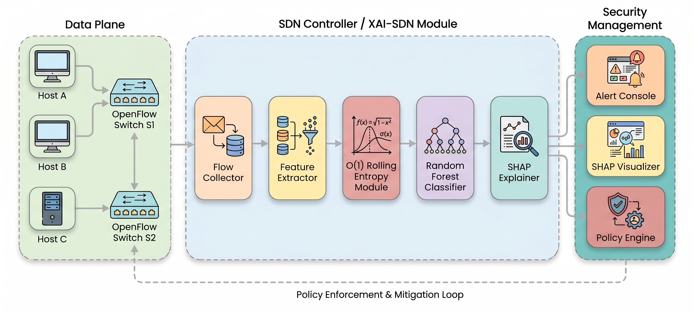
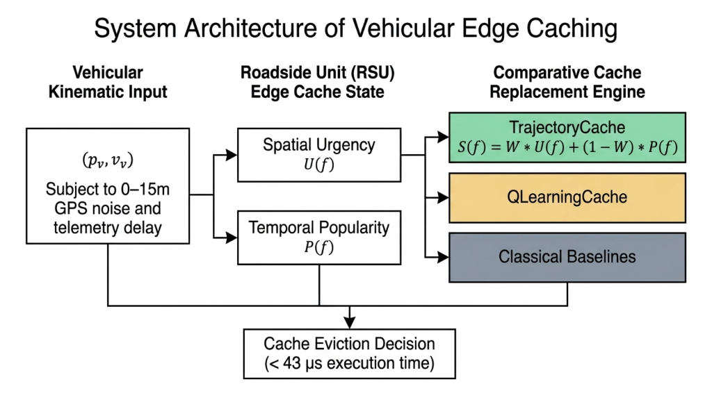
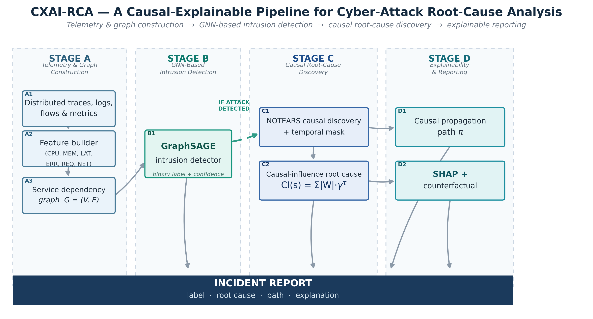

# 𝙃𝙚𝙡𝙡𝙤, 𝙄'𝙢 𝘼𝙙𝙚𝙚𝙡 𝘼𝙝𝙢𝙖𝙙 👋

I like 𝘾𝙮𝙗𝙚𝙧𝙨𝙚𝙘𝙪𝙧𝙞𝙩𝙮, 𝘼𝙄 & 𝙉𝙚𝙩𝙬𝙤𝙧𝙠𝙨!

🛡️ 𝙍𝙚𝙨𝙚𝙖𝙧𝙘𝙝𝙚𝙧 𝙗𝙪𝙞𝙡𝙙𝙞𝙣𝙜 𝙩𝙧𝙪𝙨𝙩𝙬𝙤𝙧𝙩𝙝𝙮 𝘼𝙄 𝙛𝙤𝙧 𝙘𝙧𝙞𝙩𝙞𝙘𝙖𝙡 𝙣𝙚𝙩𝙬𝙤𝙧𝙠𝙨.

🎓 IT student at **IUM** on a fully-funded **Saudi Government scholarship** &nbsp;·&nbsp; 📍Saudi Arabia
🔭 Focused on **Explainable AI**, **Federated Learning** & **Edge Caching**
🌱 Currently doing hands-on **TryHackMe** cybersecurity labs + **AWS SAA** & **CCNA** prep

### ✨ Highlights

## 𝗙𝗲𝗮𝘁𝘂𝗿𝗲𝗱 𝗣𝗿𝗼𝗷𝗲𝗰𝘁𝘀  ·  𝗣𝗮𝗽𝗲𝗿 𝗔𝗿𝗰𝗵𝗶𝘁𝗲𝗰𝘁𝘂𝗿𝗲𝘀

<table>
  <tr>
    <td width="50%" valign="top">
      
      
<b>XAI-SDN — Explainable DDoS Detection</b> Flow collection → O(1) rolling-entropy features → Random Forest → SHAP explanations, feeding a real-time SDN mitigation loop.

    </td>
    <td width="50%" valign="top">
      
      
<b>TrajectoryCache — Vehicular Edge Caching</b> Balancing spatial urgency and content popularity for V2X edge caching, with sub-43µs eviction decisions.

    </td>
  </tr>
  <tr>
    <td width="50%" valign="top">
      
      
<b>Byzantine-Robust Federated Learning</b> A cloud trust engine combining cosine similarity and historical reputation to defend IoT federated learning against poisoning.

    </td>
    <td width="50%" valign="top">
      
      
<b>CXAI-RCA — Causal Root-Cause Analysis</b> Graph construction → GraphSAGE intrusion detection → NOTEARS causal discovery → SHAP + counterfactual reporting.

    </td>
  </tr>
</table>

## 𝗣𝘂𝗯𝗹𝗶𝗰𝗮𝘁𝗶𝗼𝗻𝘀

| Status | Paper | Venue |
|:------:|-------|-------|
| 🟢 **Accepted** | Privacy Leakage in Federated Learning: Gradient-Based Client Identity Inference &amp; Defense Analysis | IEEE VTC2026-Fall |
| 🟡 **Peer Review** | Balancing Spatial Urgency &amp; Content Popularity for Edge Caching in Vehicular Networks | Springer Nature — Discover Telecommunications |
| ⚪ **Under Review** | XAI-SDN: Lightweight, Interpretable DDoS Detection for SDN | Journal (awaiting decision) |
| ⚪ **Under Review** | Adaptive Multi-Factor Trust Aggregation for Byzantine-Robust Federated Learning in IoT | Journal (awaiting decision) |

## 𝗠𝘆 𝗧𝗲𝗰𝗵 𝗦𝘁𝗮𝗰𝗸

  

**Networking &amp; Simulation**

## 𝗦𝘁𝗮𝘁𝘀

  

<!-- refresh -->
